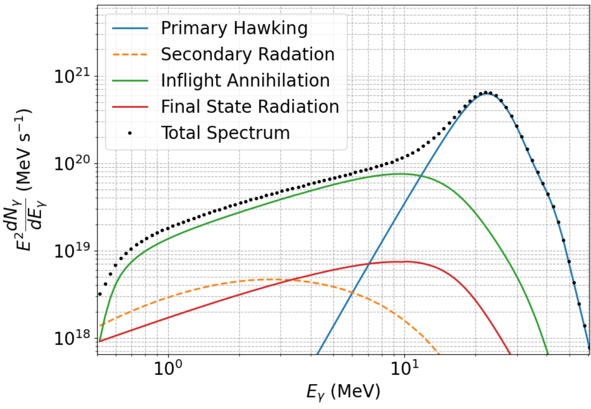
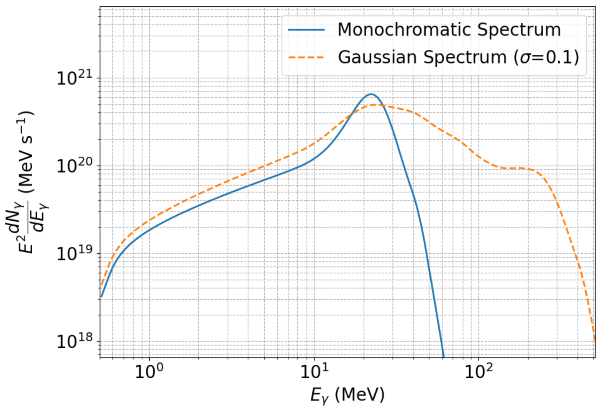

# Summary

We present `GammaPBHPlotter`, a public Python code for calculating and
plotting the Hawking radiation gamma-ray spectra of primordial black
holes in the mass range of $10^{14}$ to $10^{18}$ grams. This tool
allows users to compute the monochromatic and mass-averaged spectra of
black holes over a range of parameters. We include the primary/direct
Hawking emission, the secondary emission from the decay and
hadronization of unstable particles, the final state radiation, and the
in-flight annihilation gamma-ray emission components.

# Statement of Need

Hawking radiation remains an unobserved property of black holes. As the
temperature of black holes is inversely proportional to the square of
their mass, conventional stellar mass black holes are expected to emit
too little radiation to ever be detected. However, primordial black
holes (PBHs) that could have formed from the collapse of primordial
perturbations in the early universe can provide detectable signals.
PBHs with mass less than $10^{14}$ grams would have evaporated via
Hawking radiation long before the present age of the universe. Upcoming
gamma-ray telescopes such as e-ASTROGAM and AMEGO-X will be sensitive
enough in the MeV range to detect the Hawking spectra of PBHs lying
between this lower bound and $10^{19}$ grams. We have developed
`GammaPBHPlotter`, an open-source software to simulate the exact
gamma-ray spectra produced from different PBH mass distributions.

# Hawking Spectra

## Modeling the emission components

The gamma-ray spectrum of a PBH within the relevant mass range consists
of four primary components: direct/primary Hawking radiation, secondary
radiation, final-state radiation, and in-flight annihilation.

Direct Hawking radiation accounts for all kinematically allowed
elementary particles formed at the event horizon, including gamma-ray
photons. Secondary radiation originates from the decay of unstable
particles and contributes significantly at lower energies. We rely on
`BlackHawk` to evaluate the gamma-ray primary and secondary spectral
components. `BlackHawk` uses `PYTHIA` for the modeling of the
hadronization and decay processes leading to the secondary spectra.
Final-state radiation originates from relativistic electrons and
positrons and has a differential spectrum given by Eq. [1](#eq:FSRRate):

$$
\frac{dN_{\gamma}^{\mathrm{FSR}}}{dE_{\gamma}}
=\frac{\alpha}{2\pi}\int dE_{e^{+}}\,
\frac{dN_{e^{+}}}{dE_{e^{+}}}
\left(\frac{2}{E_{\gamma}}+\frac{E_{\gamma}}{E_{e^{+}}^{2}}-\frac{2}{E_{e^{+}}}\right)
\left[\ln\!\left(\frac{2E_{e^{+}}+(E_{e^{+}}-E_{\gamma})}{m_{e}^{2}}\right)-1\right].
$$

where $\alpha=137.037$ is the fine-structure constant, $E_{e^{+}}$
is the kinetic energy of a given positron ($e^{+}$), $E_{\gamma}$ is
the energy of the emitted photon, $m_{e}=0.511\ \mathrm{MeV}$ is the rest
mass of the electron, and $\frac{dN_{e^{+}}}{dE_{e^{+}}}$ is the
differential spectrum of emitted electrons/positrons. In addition to the
previously mentioned components, gamma rays can be produced through
pair-annihilation of positrons with interstellar medium electrons. This
is known as in-flight annihilation and its differential spectrum is given
by Eq. [2](#eq:IARate):

$$
\frac{dN_{\gamma}^{\mathrm{IA}}}{dE_{\gamma}}
=\frac{\pi\alpha^{2}n_{H}}{m_{e}}
\int_{m_{e}}^{\infty} dE_{e^{+}}\,
\frac{dN_{e^{+}}}{dE_{e^{+}}}
\int_{E_{\min}}^{E_{e^{+}}}
\frac{dE}{dE/dx}\,
\frac{P_{E_{e^{+}}\to E}}{E^{2}-m_{e}^{2}}
\left(
-2-\frac{(E+m_{e})\!\left[m_{e}^{2}(E+m_{e})+E_{\gamma}^{2}(E+3m_{e})-E_{\gamma}(E+m_{e})(E+3m_{e})\right]}
{E_{\gamma}^{2}(E-E_{\gamma}+m_{e})^{2}}
\right).
$$

We take $n_{H}=1\ \mathrm{cm}^{-3}$ as the density of interstellar
medium hydrogen (and by extension electrons). $E_{e^{+}}$ is again the
initial positron total energy, $E$ is the final positron total energy,
$dE/dx$ is the rate of positron energy lost per path via the
Bethe–Bloch formula, $E_{\gamma}$ is the resulting photon energy from
annihilation, and $P_{E_{e^{+}}\to E}$ is the probability of a
particular positron of a given initial and final energy to decay. This
probability matrix can be calculated as Eq. [3](#eq:Pmatrix):

$$
P_{E_{e^{+}}\to E}
=\exp\!\Biggl(
-\,n_{H}\int_{E}^{E_{e^{+}}}\sigma_{\mathrm{ann}}(E')\,\frac{dE'}{dx}\,dE'
\Biggr),
$$

where $\sigma_{\mathrm{ann}}$ is the annihilation cross section for
positrons of a given energy.

In Fig. 1, we give the individual gamma-ray spectral components as well
as their sum for a PBH of mass $3\times10^{15}$ grams.

**Figure 1.** The total gamma-ray spectrum of a $3\times10^{15}$ grams PBH as well as its components.

## PBH Mass Distribution

Users can calculate the gamma-ray spectra from four types of PBH mass
distributions. Those are, i) a monochromatic distribution with a mass to
be set in the range of $5\times10^{13}$ to $1\times10^{19}$ grams,
ii) a Gaussian distribution of PBH masses originating from a Gaussian
distribution of density perturbations, iii) a more realistic
non-Gaussian PBH mass distribution, and iv) a log-normal
distribution of PBH masses. In Fig. 2, we give the gamma-ray spectra
from monochromatic and Gaussian PBH mass distributions.

**Figure 2.** The total gamma-ray spectrum per PBH, from a PBH of mass $3\times10^{15}$ grams (blue line) and from a Gaussian distribution of density perturbations leading to a distribution with mean mass $3\times10^{15}$ grams. $\sigma$ refers to the standard deviation of the initial density perturbations.

# Software content

`GammaPBHPlotter` was written in `Python` version 3.9 and is capable of
running on Windows, Linux, and Mac. The main code uses five modules in
its routine: `colorama`, `numpy`, `matplotlib`, `tqdm`, and `scipy`.
Since the software automatically checks and downloads all missing
modules, this requirement should not be a concern for the user. We
provide the software in that include the code and a relevant manual.

We acknowledge the use of `BlackHawk`. This material is based upon work
supported by the U.S. Department of Energy, Office of Science, Office of
High Energy Physics, under Award No. DE-SC0022352.

# References
